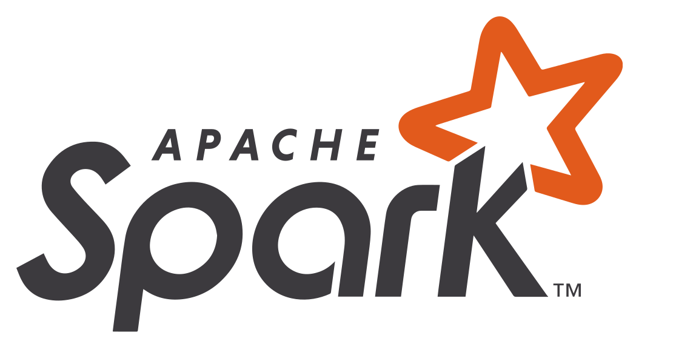

# SimRank

[![Contributors][contributors-shield]][contributors-url]
[![Forks][forks-shield]][forks-url]
[![Stargazers][stars-shield]][stars-url]
[![Issues][issues-shield]][issues-url]
[![MIT License][license-shield]][license-url]
[![LinkedIn][linkedin-shield]][linkedin-url]


<p align="center">
  <a href="https://github.com/Gigi-G/simrank" target="_blank">
    
  </a>


  <h3 align="center">PathwaySim</h3>

  <p align="center">
    Find the similarities between biological pathways using SimRank!
    <br />
    <a href="https://github.com/Gigi-G/simrank"><strong>Explore the docs »</strong></a>
    <br />
    <br />
    <a href="https://github.com/Gigi-G/simrank">View Demo</a>
    ·
    <a href="https://github.com/Gigi-G/simrank/issues">Report Bug</a>
    ·
    <a href="https://github.com/Gigi-G/simrank/issues">Request Feature</a>
  </p>


<details open="open">
  <summary>Table of Contents</summary>
  <ol>
    <li>
      <a href="#about-the-project">About The Project</a>
      <ul>
        <li><a href="#built-with">Built With</a></li>
      </ul>
    </li>
    <li>
      <a href="#getting-started">Getting Started</a>
      <ul>
        <li><a href="#prerequisites">Prerequisites</a></li>
        <li><a href="#installation">Installation</a></li>
      </ul>
    </li>
    <li><a href="#usage">Usage</a></li>
    <li><a href="#roadmap">Roadmap</a></li>
    <li><a href="#contributing">Contributing</a></li>
    <li><a href="#license">License</a></li>
    <li><a href="#contact">Contact</a></li>
    <li><a href="#acknowledgements">Acknowledgements</a></li>
  </ol>
</details>


## About The Project

This is a University Project for Big Data subject at University of Catania.

The goal is to find similarities between biological pathways using the SimRank algorithm. This was implemented in Spark using Scala.

Furthermore, within the project was made a comparison between the classic SimRank and the SimRank-Lowrank, this last one wasn't implemented by me.


### Built With

This section should list any major frameworks that you built your project using. Leave any add-ons/plugins for the acknowledgements section. Here are a few examples.
* [Hadoop](https://hadoop.apache.org/)
* [Scala](https://www.scala-lang.org/)
* [Spark](https://spark.apache.org/)
* [SimRank-LowRank](https://github.com/amkatrutsa/SimRankLowrank)


## Getting Started

### Prerequisites

* Install Hadoop 2.7.6 from the following <a href="http://www.apache.org/dyn/closer.cgi/hadoop/common/hadoop-2.7.6/hadoop-2.7.6.tar.gz" target="_blank">link</a>
* Install Scala 2.11.7 from the fpollowing link <a href="https://www.scala-lang.org/download/2.11.7.html" target="_blank">link</a>
* Install Spark 2.3.0 from the following <a href="https://www.apache.org/dyn/closer.lua/spark/spark-2.3.0/spark-2.3.0-bin-hadoop2.7.tgz" target="_blank">link</a>
* Install SimRank-LowRank from the following <a href="https://github.com/amkatrutsa/SimRankLowrank" target="_blank">link</a>
* Install jupyter-notebook from the following <a href="https://jupyter.org/" target="_blank">link</a>


### Installation

1. Clone the repo
   ```sh
   git clone https://github.com/Gigi-G/simrank.git
   ```
2. Go to **simrank**
   ```sh
   cd simrank
   ```
3. Open the pathwaysim.ipynb notebook
   ```sh
   jupyter-notebook
   ```


## Usage

Execute the cells inside the <a href="https://github.com/Gigi-G/simrank/blob/main/pathwaysim.ipynb">jupyter-notebook</a> :-)


## Roadmap

See the [open issues](https://github.com/Gigi-G/simrank/issues) for a list of proposed features (and known issues).


## Contributing

Contributions are what make the open source community such an amazing place to be learn, inspire, and create. Any contributions you make are **greatly appreciated**.

1. Fork the Project
2. Create your Feature Branch (`git checkout -b feature/AmazingFeature`)
3. Commit your Changes (`git commit -m 'Add some AmazingFeature'`)
4. Push to the Branch (`git push origin feature/AmazingFeature`)
5. Open a Pull Request


## License

Distributed under the GPL-3.0 License. See `LICENSE` for more information.


## Contact

Luigi Seminara - [@Gigii_G](https://telegram.me/Gigii_G) - seminara.luigi@gamil.com

Project Link: [https://github.com/Gigi-G/simrank](https://github.com/Gigi-G/simrank)


[contributors-shield]: https://img.shields.io/github/contributors/Gigi-G/simrank.svg?style=for-the-badge
[contributors-url]: https://github.com/Gigi-G/simrank/graphs/contributors
[forks-shield]: https://img.shields.io/github/forks/Gigi-G/simrank.svg?style=for-the-badge
[forks-url]: https://github.com/Gigi-G/simrank/network/members
[stars-shield]: https://img.shields.io/github/stars/Gigi-G/simrank.svg?style=for-the-badge
[stars-url]: https://github.com/Gigi-G/simrank/stargazers
[issues-shield]: https://img.shields.io/github/issues/Gigi-G/simrank.svg?style=for-the-badge
[issues-url]: https://github.com/Gigi-G/simrank/issues
[license-shield]: https://img.shields.io/github/license/Gigi-G/simrank.svg?style=for-the-badge
[license-url]: https://github.com/Gigi-G/simrank/blob/master/LICENSE.txt
[linkedin-shield]: https://img.shields.io/badge/-LinkedIn-black.svg?style=for-the-badge&logo=linkedin&colorB=555
[linkedin-url]: https://it.linkedin.com/in/luigi-seminara-3bb2a2204
[product-screenshot]: images/screenshot.png
